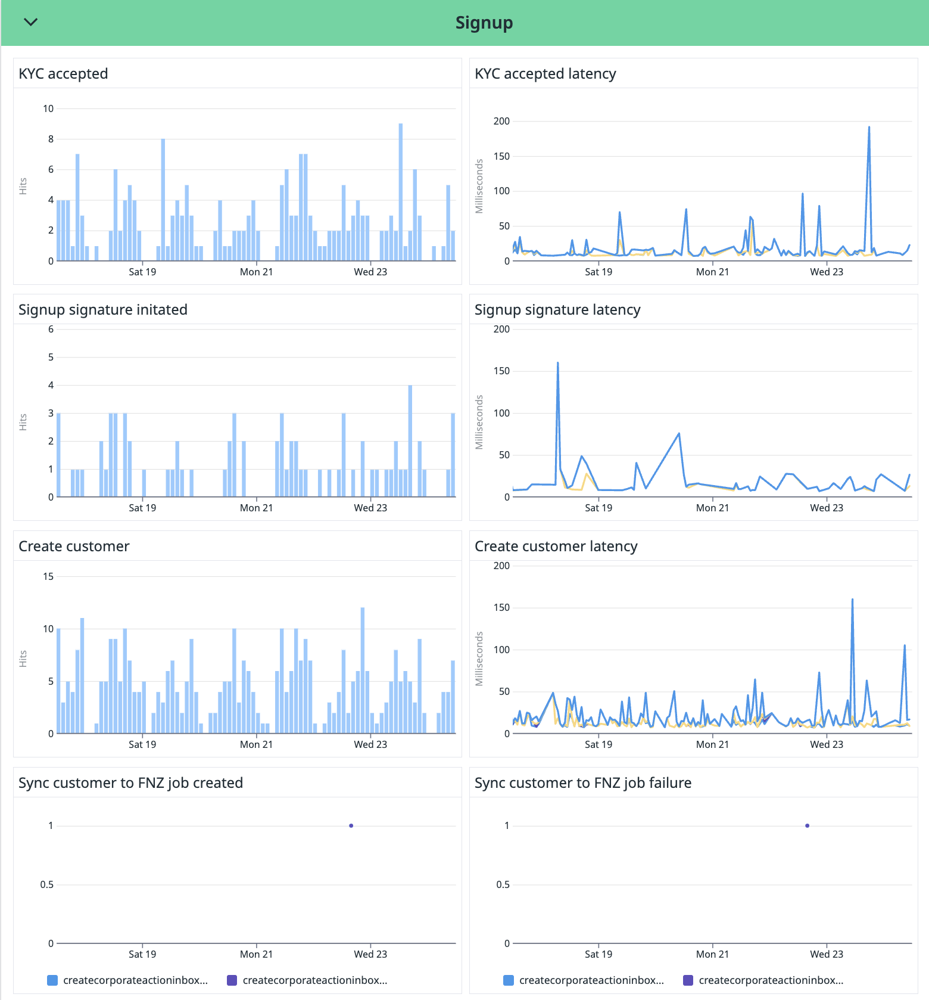

# Observability Strategy

The observability strategy aims to ensure that each service owner can confidently answer the following key questions:

 1. #### How do we know that the service is working as intended?
 2. #### How do we know that the service is _not_ working as intended?

To address these questions, the strategy involves setting up a dashboard that makes it easy for anyone on the team to quickly assess the health and performance of a service. Additionally, monitors should be placed on key features that need to be covered by the on-call team.

Observability should be a core consideration when building features. Each new feature introduced should be evaluated for its potential need for monitoring, ensuring that all functions critical to the business are properly tracked and monitored.

## **1. Define key indicators of service health**

The responsibility of defining the health indicators lies with the owner of each service. These indicators will vary depending on the nature and functionality of the service but can cover such as:

- **Availability**: Is the service up and running? 
- **Latency**: How fast is the service responding to requests?
- **Error Rate**: How many requests are failing? Track the number of 4xx/5xx responses.
- **Throughput**: How many requests or transactions is the service handling per minute/second? 
- **Resource Utilization**: Track CPU, memory, disk, and network usage.
- **Other Business-Specific Metrics:** Depending on the nature of the service, metrics such as the number of successful signups, orders processed, or funds transferred may be critical. These metrics can be event-driven, collected when specific events occur, or gauge-based, where scheduled jobs gather data at specific intervals, depending on the nature of what is being monitored.

It is important to base these service health considerations around what the business goals of the service are. 

**Example - behemoth**

The responsibilities of Behemoth include, but are not limited to: enabling customers to complete signups, create accounts, make deposits and withdrawals, place orders for ETIs and mutual funds, and providing users with critical information regarding their holdings and accounts.

Lets look at a specific example.

**Enabling customers to complete signups**

To uphold this responsibility, the following actions need to be performed:
- Persist KYC (Know Your Customer) data
- Generate a QR code from bankID
- Persist the customer’s signature
- Sync the user data with FNZ

To answer the questions at the top of the document one could:

* Track the availability and latency for the endpoints involved. 
* Track the number of KYC data is persisted successfully/unsuccessfully.
* Track the number of times a QR code is generated successfully/unsuccessfully.
* Track the number of times a customers signature is persisted successfully/unsuccessfully.
* Track the number of times a customers data is synced successfully/unsuccessfully to FNZ.

To know that the service is upholding it's responsability in this area we could then place all of these metrics on a dashboard. 

Using this dashboard, we can specify the answers to the questions regarding the health of the service for this part.

Using this dashboard, we can specify the answers to the questions regarding the health of the service for this part.

We can observe that no errors are present and that latency is low for each of the steps: _KYC accepted_, _signup signature initiated_, and _create customer_. However, we can also see that only one job was initiated, and that job failed. This indicates that the service, in this example, is not healthy.

This type of work should be done for _all_ features which are critical to the business. 

## **2. Create Service-Level Objectives (SLOs) and monitors**

Once key health indicators are defined, the next step is to establish Service-Level Objectives (SLOs). SLOs are measurable goals that define the acceptable performance and reliability of a service from the perspective of the users and the business.

SLOs are typically created based on the key indicators mentioned in the first section.

**Example - behemoth**

Let’s return to the Behemoth example, focusing on the **signup process** and using specific SLOs based on the steps defined in the earlier section.

For this feature, we could define the following SLOs:

1. **Persist KYC (Know Your Customer) data**
   - **Availability**: 99.9% uptime during business hours.
   - **Latency**: 95% of requests should complete within 300ms.
   - **Error Rate**: Less than 0.5% of requests should fail.

2. **Generate QR code from bankID**
   - **Availability**: 99.9% uptime during business hours.
   - **Latency**: 95% of requests should complete within 400ms.
   - **Error Rate**: Less than 1% of QR code generations should fail.

3. **Persist customer signature**
   - **Availability**: 99.9% uptime during business hours.
   - **Latency**: 95% of requests should complete within 500ms.
   - **Error Rate**: Less than 0.5% of signature persistence attempts should fail.

4. **Sync user data to FNZ**
   - **Availability**: 99.9% uptime during business hours.
   - **Latency**: 95% of sync requests should complete within 1 second.
   - **Error Rate**: Less than 0.5% of sync attempts should fail.

These SLOs are directly tied to the signup process and its critical steps. By monitoring these objectives, the team can ensure that Behemoth’s signup process is performing as expected and that it meets both business and user requirements.

For example, if latency for **persisting KYC data** exceeds the 300ms threshold, the team will be alerted to investigate performance issues before they impact a larger number of users. Similarly, if the error rate for **QR code generation** spikes above 1%, the team can take immediate action to address the underlying problem, preventing further disruptions.

